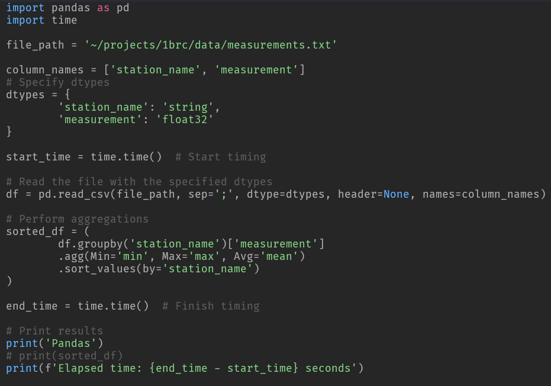

# Intro
I saw posts floating around talking about the '1 billion row challenge' and decided to try it myself. Initially, I was skeptical that Python could even handle 1 billion rows, and honestly, I come away thinking 1) it can't but 2) DuckDB can. 

# The challenge
The 1 billion row challenge was put out by -. Initially, it was pitched as a competition to see who could create the fastest java script processing a 1 billion row CSV. I saw the challenge after others picked up on it and started attempting it in other languages. Here's the repository

The repo contains a bunch of shell files used to evaluate the scripts submitted for the competition. The important parts are 1) the src/ folder, which has scripts in various languages to create the csv file and 2) the data/ folder which has the csv file generated by the src/ scripts

The CSV file consists of two fields, station_name and measurements. These represent fictitious weather stations and some decimal measurement number taken at each station. 

The task was to read in the CSV file, perform some aggregations grouped by the station_name, and order the results. I tested the various Python packages with 100 million rows, 300 million rows, and 1 billion rows. 

# How'd they do?
I set out to compare how different Python packages handled 1 billion rows and settled on what I was already familiar with: Pandas, Polars, and DuckDB. 

### Pandas

