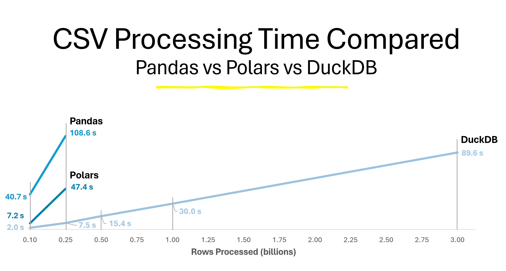

# The 1 Billion Row Challenge in Python


# What is this?
This is a blog post expanding on this project I tried out - the 1 Billion Row Challenge in Python - which I also presented at the Michigan Python May 2024 Meetup group as part of my presentation "Accelerating Python Data Analysis with DuckDB".

- Link to a recording of the talk [here](https://www.youtube.com/watch?v=9EL1AEXrybU) 
- Link to my GitHub repo with scripts used for the presentation, along with the PowerPoint slides [here](https://github.com/JustinSmethers/intro-to-duckdb) 
- Link to my GitHub repo with scripts used for the billion row challenge [here](https://github.com/JustinSmethers/billion-row-challenge-python)

# Intro
I saw posts floating around talking about the '1 billion row challenge' and decided to try it myself. Initially, I was skeptical that Python could even handle 1 billion rows and I come away thinking 1) it can't but 2) DuckDB can. 

# The challenge
The 1 billion row challenge was created by software engineer [Gunnar Morling](https://github.com/gunnarmorling). Initially, it was pitched as a competition to see who could create the fastest Java script processing a 1 billion row CSV. I came across the challenge after others picked up on it and attempted it in other languages. [Here's the challenge repository](https://github.com/gunnarmorling/1brc). 

The repo contains a bunch of shell files used to evaluate the scripts submitted for the competition. The important parts are 1) the src/ folder, which has scripts in various languages to create the csv file with a specified number of rows and 2) the data/ folder contains has the csv file generated by the src/ scripts

The CSV file consists of two fields, station_name and measurements. These represent fictitious weather stations and some decimal measurement number taken at each station. 

The task is to read in the CSV file, group the data by station_name and find the minimum, maximum, and average of the measurement column for each, and order the results alphabetically by station name. 

I attempted the challenge with Pandas, Polars, and DuckDB using 100 million rows, 250 million rows, 500 million rows, 1 billion rows, and 3 (3!) billion rows. 

# How'd they do?
I set out to compare how different Python packages handled 1 billion rows and settled on the packages I was already familiar with: Pandas, Polars, and DuckDB. I compare how long it took for my computer to run the script with the chosen number of rows. I timed how long it took for each package to read in the csv and perform the aggregations on the data - this compares both the CSV reader performance of each package and the time it takes to aggregate the data. I ran the code locally on my PC, so here are my CPU and RAM specs for reference:
- CPU: AMD Ryzen 5 3600 6-Core Processor 3.59 GHz
- RAM: 32.0 GB

### Pandas
Here's the Pandas code I used for this challenge:

~~~python
import pandas as pd
import time


file_path = '~/projects/1brc/data/measurements.txt'
column_names = ['station_name', 'measurement']

# Specify dtypes
dtypes = {
        'station_name': 'string',
        'measurement': 'float32'
}

start_time = time.time()  # Start timing
# Read the file with the specified dtypes
df = pd.read_csv(file_path, sep=';', dtype=dtypes, header=None, names=column_names)

# Perform aggregations
sorted_df = (
        df.groupby('station_name')['measurement']
        .agg(Min='min', Max='max', Avg='mean')
        .sort_values(by='station_name')
)

end_time = time.time()  # Finish timing

# Print results
print('Pandas')
print(f'Elapsed time: {end_time - start_time} seconds')
~~~

Below is a table with the number of rows processed on a particular run, and how many seconds it took to complete the operation

| Rows Processed | Time Elapsed (seconds) |
| -------------- | ---------------------: |
| 100 million    |                   40.7 |
| 250 million    |                  106.8 |
| 500 million    |                 Killed |

When I ran the script to process 500 million rows, I ran into a memory error and the process was killed 

### Polars
Here's the Polars code I used for this challenge:

```python
import polars as pl
import time
  

file_path = '~/projects/1brc/data/measurements.txt'
column_names = ['station_name', 'measurement']

# Specify dtypes
dtypes = {
    'station_name': pl.Utf8,
    'measurement': pl.Float32
}

start_time = time.time()  # Start timing
df = (
    # Read the file with the specified dtypes
    pl.scan_csv(
        file_path,
        separator=';',
        dtypes=dtypes,
        new_columns=column_names)
    # Perform aggregations
    .group_by("station_name")
    .agg([
        pl.col('measurement').min().alias('Min'),
        pl.col('measurement').max().alias('Max'),
        pl.col('measurement').mean().alias('Mean')
    ])
    .sort('station_name')
    .collect()
)
end_time = time.time()  # Finish timing

# Print results
print('Polars')
print(f'Elapsed time: {end_time - start_time} seconds')
```

Below is a table with the number of rows processed on a particular run, and how many seconds it took to complete the operation

| Rows Processed | Time Elapsed (seconds) |
| -------------- | ---------------------: |
| 100 million    |                   7.2s |
| 300 million    |                   47.4 |
| 500 million    |                 Killed |

Same as Pandas, when I ran the script to process 500 million rows, I ran into a memory error and the process was killed.

### DuckDB
Here's the DuckDB code I used for this challenge:

```python
import duckdb
import time
  

file_path = '~/projects/1brc/data/measurements.txt'

# Define query
query = f"""
    select
        station_name,
        min(measurement) as Min,
        max(measurement) as Max,
        avg(measurement) as Mean

    from read_csv_auto('{file_path}', sep=';', columns = {{'station_name': 'STRING', 'measurement': 'FLOAT'}})

    group by station_name
    order by station_name
"""
start_time = time.time()  # Start timing

# Connect to DuckDB (in-memory mode)
conn = duckdb.connect(database=':memory:', read_only=False)

# Execute the query and fetch the results
result = conn.execute(query).fetchall()

end_time = time.time()  # Finish timing

# Print results
print('DuckDB')
print(f'Elapsed time: {end_time - start_time} seconds')
```

Below is a table with the number of rows processed on a particular run, and how many seconds it took to complete the operation

| Rows Processed | Time Elapsed (seconds) |
| -------------- | ---------------------: |
| 100 million    |                    2.0 |
| 250 million    |                    7.5 |
| 500 million    |                   15.4 |
| 1 billion      |                   30.0 |
| 3 billion      |                   89.6 |

### Results - Visualized
Below is an image of a chart I made for the presentation comparing the time elapsed vs number of rows processed for each library

# Conclusion
DuckDB was far and away the fastest tool for processing massive CSV files, but I want to note 2 things:

1. This challenge is definitely set up to take advantage of DuckDB's performance - With DuckDB being an analytical database, it does exceptionally well at retrieving data and performing aggregations on that data, even up to large-ish scale workloads (clearly). Pandas/Polars could perform better at different tasks, I'm not sure. Also, it may be worth exploring the performance of the CSV readers of each package. From what I understand, DuckDB's CSV reader is also just exceptionally fast, so that may contribute to its speed in this challenge relative to Pandas and Polars
2. Most day-to-day workloads probably don't involve processing 100s of millions (or billions) of rows, so this challenge may not be representative of how DuckDB compares on those workloads. However, I've found that DuckDB still performs meaningfully faster on day-to-day-scale tasks. See the Streamlit files in the [GitHub repo](https://github.com/JustinSmethers/intro-to-duckdb), where I demoed identical Streamlit apps, one using DuckDB and one using Pandas. I found that on a ~2 million row dataset, the DuckDB x Streamlit app took just under 2 seconds to render on my PC, while the Pandas x Streamlit app took just under 5 seconds 
   
I've definitely resolved to use DuckDB more often as a result of this challenge