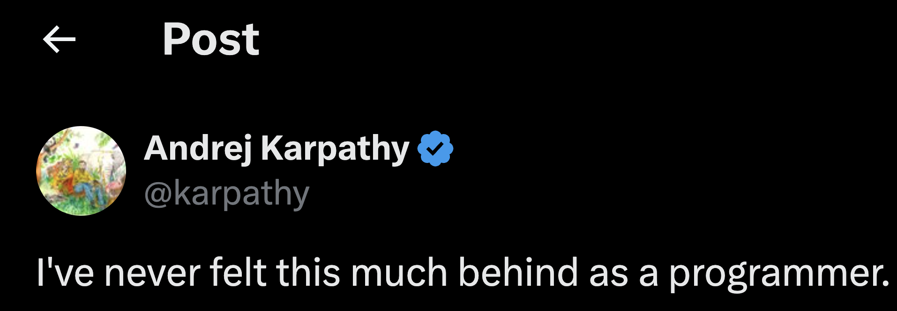

## intro

I’m experiencing a step change in productivity and anxiety after the release of Opus 4.5 and gpt-5.2-codex. This is the first time terminal agents really *feel* like junior colleagues. Specifically, they’re much more capable than a junior colleague, but now they only make mistakes as bad as a junior, not worse. 

## the productivity

I feel the need to flag this moment because coding is seriously changing. I feel it in my work. Since the release, I don’t need to write a single line of code if I’m working on a well-defined problem. I can get tested, ready-to-go code with one prompt. I could even create a bash script to pull down a jira ticket, create a dev container, and have a template prompt to plan and implement a solution to the ticket in one command (and of course that bash script will be written using codex). What's the point of having me in the loop...

However, this also means I can move on to some harder problems. Nothing too impressive, I'm still early in learning software engineering, but I'm able to contribute to more internal projects, push for more open source contributions, and make more meaningful side projects than ever before (posts incoming...).

## the anxiety

Engineers much smarter than me are doing much more than me and seeing much bigger shifts than I'm capable of. In other words, how the hell do I keep up?

For example, this post from Boris Cherny of Claude Code - [link](https://x.com/bcherny/status/2004897269674639461?s=19)
![[Pasted image 20260104164627.png]]

Or this twitter exchange between Andrej Caparthy and Boris Cherny has been on my mind for days - [link](https://x.com/bcherny/status/2004626064187031831?s=46&t=yQDRKYkkVW8gIi9IzD02dw)
![[Pasted image 20260104164325.png]]

## what I can do about it

Hopefully work on bigger/more impactful/more exciting things aided/driven by terminal agents. See, this post from Chris Albon - [link](https://x.com/chrisalbon/status/2004744742765228055?s=46&t=yQDRKYkkVW8gIi9IzD02dw)

![[Pasted image 20251227154323.png]]

Or maybe I'll be "cleaning this dog shit up for 20 years", but I sort of doubt that - [link](https://x.com/kenwheeler/status/2004960488250372302)

![[Pasted image 20251227155121.png]]

For now, I'll post my cute little blogs and make my cute little side projects and make my cute little devcontainer setup and ignore the anxiety.